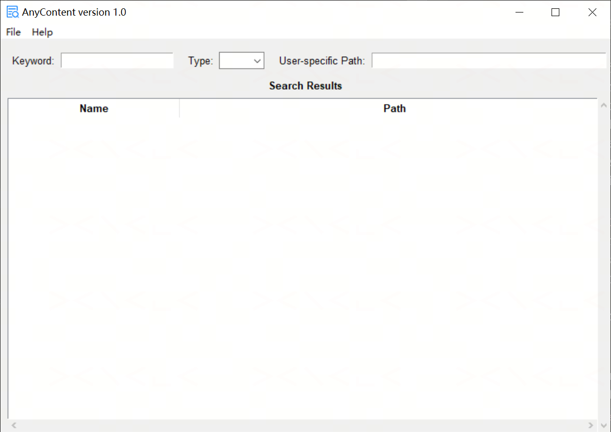
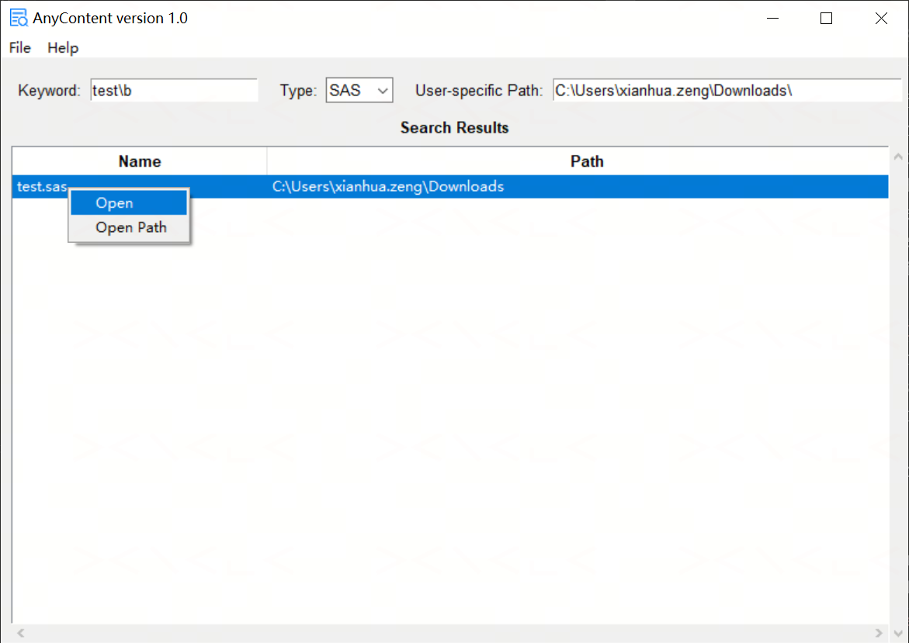

# AnyContent

A Windows desktop tool (GUI + CLI) to search — and optionally replace — keywords across SAS, TXT, RTF, PDF, DOCX, PY, and JSON files in a folder tree, with dedicated handling for PDF annotations vs. PDF body text — built with Python and Tkinter.

---

## Background

Clinical trial programming environments contain large volumes of mixed file types — SAS programs, logs, RTF outputs, annotated CRF PDFs, specification documents, and more — often spread across deep folder structures. Locating every file that references a given keyword (a variable name, a macro, a CRF annotation) usually means searching each file type with a different tool, or none at all.

AnyContent automates this by recursively scanning a target directory for a keyword across multiple file types in a single pass, distinguishing between **PDF annotations** (e.g., aCRF `/FreeText` notes) and **PDF body text**, and optionally performing an in-place **find-and-replace** for SAS/JSON files.

---

## Features

- **Multi-format search** — searches SAS, TXT, RTF, PDF, DOCX, PY, and JSON files in one run, or a single selected type
- **Encoding-aware matching** — auto-detects file encoding (BOM-aware UTF-8 / GBK fallback) and matches the keyword as plain text, GB2312-escaped, and Unicode-escaped, so Chinese keywords are found regardless of how they were saved
- **Dual-mode RTF CJK handling** — automatically detects whether an RTF file encodes Chinese characters as `\uXXXX;` Unicode escapes (SAS-generated) or `\'XX` GBK hex escapes (Word/other tools), and matches/replaces using the correct mode per file
- **PDF annotation search** — searches `/FreeText` (and `/Widget`) annotations only (e.g., aCRF page notes)
- **PDF body text search** — searches extracted page text (`pdfminer`) for files with no matching annotation
- **DOCX content search** — searches paragraph text extracted directly from `word/document.xml`
- **Find-and-replace** — for SAS, TXT, RTF, PY, and JSON files, replaces every match of the keyword with a replacement string in place; a confirmation prompt (GUI dialog / CLI `y/N`) is shown before any file is modified
- **Interactive results grid** — results appear in a Name/Path table; double-click or right-click to open the file or its containing folder
- **Background search** — search runs in a separate thread so the GUI stays responsive
- **CLI mode** — all search features are available from the command line for scripting and automation

---

## Requirements

| Requirement | Notes |
|---|---|
| Windows | Tested on Windows 10/11 |
| Python 3.8+ | |

---

## Installation

```bash
git clone https://github.com/XianhuaZeng/Projects.git
cd Projects/AnyContent
pip install -r requirements.txt
```

Key dependencies: `pypdf` (with `PyPDF2` as a fallback if `pypdf` is unavailable), `pdfminer.six`, `beautifulsoup4`, `lxml`.

---

## Usage

### GUI mode

Double-click `AnyContent.py`, or run:

```bash
python AnyContent.py
```



**Steps:**
1. Enter a **Keyword** to search for
2. (Optional) Select a **Type** from the dropdown — `SAS`, `TXT`, `RTF`, `PDF`, `DOCX`, `PY`, or `JSON`. Leave blank to search all supported types
3. (Optional) Enter a **User-specific Path** to search a specific folder. Leave blank to use the default path (D:\)
4. Press **Enter** to start the search
   - If the keyword includes a `` `replacement `` (see [Keyword syntax](#keyword-syntax)), a confirmation dialog appears first — click **Yes** to proceed with the replacement, or **No** to cancel
5. Results appear in the **Search Results** grid:
   - **Name** — file name
   - **Path** — containing folder
6. **Double-click** a row (or right-click → **Open**) to open the file; right-click → **Open Path** to open its folder



---

### CLI mode

When any command-line argument is provided, the GUI is skipped and the tool runs entirely in the terminal.

```
python AnyContent.py search -k KEYWORD [-t TYPE] [-p PATH]
```

| Option | Description |
|---|---|
| `-k`, `--keyword` | Keyword to search (required). Supports the same backtick syntax as the GUI — see [Keyword syntax](#keyword-syntax) |
| `-t`, `--type` | File type to restrict search to: `SAS`, `TXT`, `RTF`, `PDF`, `DOCX`, `PY`, `JSON`. Omit to search all types |
| `-p`, `--path` | Root directory to search. Omit to use the default path (D:\) |

**CLI examples:**

```bash
# Search all file types for "diabetes"
python AnyContent.py search -k diabetes

# Search SAS files only
python AnyContent.py search -k diabetes -t SAS

# Search in a specific folder
python AnyContent.py search -k diabetes -t PDF -p C:\studies\proj01

# Replace keyword in SAS/JSON files
python AnyContent.py search -k "OLDVAR`NEWVAR"

# Search PDF annotations only
python AnyContent.py search -k "Adverse Event``acrf"

# Search PDF body text only
python AnyContent.py search -k "Adverse Event``crf"
```

Exit codes: `0` — matches found; `1` — no matches found, error, or replacement cancelled by user.

> When the keyword includes a `` `replacement ``, the CLI prompts for confirmation before touching any file:
> ```
> Replace all matches of 'OLDVAR' with 'NEWVAR' under D:\? This will overwrite files in place and cannot be undone. [y/N]:
> ```
> Type `y` to proceed; anything else cancels the run (exit code `1`) without modifying files.

---

### Keyword syntax

The keyword field (GUI and CLI alike) supports an extended syntax using the backtick (`` ` ``) as a delimiter, enabling search-and-replace and PDF search-mode control without separate input fields:

> 🔎 **Regex support** — the keyword is matched as a Python regular expression (`re.search`, case-insensitive), not a literal string. This means standard regex syntax works, e.g. `test\b` (word boundary), `^DM`, `AE|CM` (alternation), `var[0-9]+`. If your keyword contains regex special characters (`. * + ? ( ) [ ] { } | ^ $ \`) and you want a literal match, escape them (e.g. `2\.5` to match `2.5` literally).
>
> Exception: for **RTF** files where Chinese-character escapes are detected (`\uXXXX;` or `\'XX` mode), matching uses an escape-aware literal pattern built from the keyword instead of the raw regex, so regex metacharacters are treated literally in that mode. Plain-ASCII RTF files, and all other file types (SAS/TXT/PY/JSON/DOCX/PDF), use full regex matching.

| Pattern | Behavior |
|---|---|
| `keyword` | Search only |
| `keyword` `` `replacement` | Search SAS/TXT/RTF/PY/JSON files and replace every match with `replacement` |
| `keyword` `` ``acrf` | Search PDF **annotations** only (e.g., aCRF `/FreeText` notes) |
| `keyword` `` ``crf` | Search PDF **body text** only (skips files already matched via annotations) |

> ⚠️ The replace mode writes changes back to the original file in place. There is no undo — back up files before using replacement on a shared folder. A confirmation prompt (GUI dialog, or `[y/N]` in the CLI) always appears before any file is modified, and the run is cancelled if you don't confirm.

#### Examples

```
DM                          → search all supported types for "DM"
test\b                      → regex search: "test" as a whole word (word boundary)
AE|CM                       → regex search: "AE" or "CM"
OLDVAR`NEWVAR               → search SAS/TXT/RTF/PY/JSON for "OLDVAR", replace with "NEWVAR"
Adverse Event``acrf         → search aCRF PDF annotations for "Adverse Event"
Adverse Event``crf          → search PDF body text for "Adverse Event"
```

---

## How matching works

> The keyword is a regular expression, not a literal string (see [Keyword syntax](#keyword-syntax) for details and the RTF exception).

- **SAS / TXT / PY / JSON** — files are read with their auto-detected encoding; a line matches if the keyword is found as plain text/regex, or as its GB2312-escaped or Unicode-escaped representation (so Chinese text saved under different encodings is still matched)
- **RTF** — read as raw bytes (`latin-1`) so both Unicode (`\uXXXX;`) and GBK hex (`\'XX`) escapes survive intact; the file's CJK encoding mode is auto-detected and the keyword is matched (and replaced) using the corresponding pattern
- **DOCX** — paragraph text is extracted from the document XML and matched the same way as plain text files
- **PDF (annotations)** — `/FreeText` and `/Widget` annotation contents are matched
- **PDF (body text)** — page text is extracted with `pdfminer` and matched; files already found via annotation search in the same run are skipped to avoid duplicate rows
- Matching is case-insensitive and stops at the first match per file (one row per file, not per occurrence)

---

## File detection

By default, AnyContent recursively walks the given path (or D:\ if no path is entered) and collects every file whose extension matches the selected type, skipping Office lock files (names starting with `~`).

---

## Project structure

```
AnyContent/
├── AnyContent.py            # Main application (GUI + CLI)
├── AnyContent.ico           # Application icon
├── requirements.txt
├── README.md
├── LICENSE
└── docs/
    ├── screenshot.png
    └── search_results.png
```

---

## License

MIT License — see [LICENSE](LICENSE) for details.