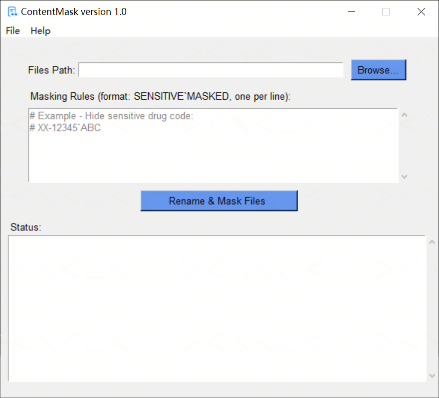

# ContentMask

A Windows desktop tool (GUI + CLI) to rename, mask, and verify sensitive information (e.g. drug codes, compound names) across XLSX/DOCX/PDF files in a folder — built with Python and Tkinter.

---

## Background

Before clinical trial documents (datasets, shells, reports, blank CRFs) can be shared externally or used in training materials, sensitive identifiers — drug codes, compound names, sponsor-specific terms — often need to be masked or replaced with placeholder values. This needs to happen consistently across file *names*, file *content* (including tables, headers, and footers), and — for PDFs — the actual rendered text on the page, not just the underlying text layer.

Doing this by hand, file by file, is slow and easy to get wrong: a term might be masked in the body text but missed in a header, or replaced inconsistently between a hyphenated form (`HS-10383`) and a bare form (`10383`). ContentMask automates the whole pipeline — rename, mask, and verify no unmasked occurrences remain — across a whole folder in one run.

---

## Features

- **Batch file renaming** — renames any file whose name contains a sensitive term to its masked equivalent
- **Multi-format content masking**:
  - **XLSX** — replaces matching text in every cell, across all sheets
  - **DOCX** — replaces matching text in paragraphs, tables, headers, and footers; uses `python-docx` by default, or Microsoft Word COM automation for files whose name contains `统计分析报告` or `sap` (for documents where COM handles formatting/fields more reliably)
  - **PDF** — extracts text coordinates, redacts (blacks out) the original text, and re-inserts the masked text at the same position, preserving page layout
- **Hyphenated-code awareness** — a rule for `HS-10383` also automatically masks the longest bare segment (`10383`), so partial references are caught too
- **Post-mask verification** — re-scans every file after masking and reports any remaining unmasked occurrences, with exact location (cell, paragraph, table/row/col, or PDF page)
- **Real-time, color-coded status** — progress, successes, warnings, and errors stream into the GUI status box as processing happens
- **Thread-safe GUI** — masking runs in a background thread with a message-queue bridge to the UI, so the window never freezes
- **CLI mode** — the full rename/mask/verify pipeline is available from the command line for scripting and automation

---

## Requirements

| Requirement | Notes |
|---|---|
| Windows | Tested on Windows 10/11; the SAP/统计分析报告 DOCX path requires Microsoft Word installed |
| Python 3.8+ | |
| Microsoft Word | Only needed for DOCX files masked via the Word COM path (filename contains `统计分析报告` or `sap`) |

---

## Installation

```bash
git clone https://github.com/XianhuaZeng/Projects.git
cd Projects/ContentMask
pip install -r requirements.txt
```

Key dependencies: `openpyxl`, `python-docx`, `pdfplumber`, `PyMuPDF` (imported as `fitz`), `PyPDF2`, `pywin32`.

---

## Usage

### GUI mode

Double-click `ContentMask.py`, or run:

```bash
python ContentMask.py
```



**Steps:**
1. Click **Browse...** and select the folder containing the files to mask
2. Enter **Masking Rules** in the text box, one per line, in the format `SENSITIVE`MASKED`` (lines starting with `#` are treated as comments and ignored)
3. Click **Rename & Mask Files**
4. Progress streams into the **Status** box in real time — masked files are shown in green, errors in red, verification warnings in orange
5. On completion, a summary dialog appears and the folder is opened automatically

---

### CLI mode

When any command-line argument is provided, the GUI is skipped and the tool runs entirely in the terminal.

```
python ContentMask.py mask -d DIR -r RULES_FILE
```

| Option | Description |
|---|---|
| `-d`, `--dir` | Folder containing files to mask (required) |
| `-r`, `--rules` | Path to a text file with masking rules, one `SENSITIVE`MASKED`` pair per line (required) |
| `--version` | Show version and exit |
| `-h`, `--help` | Show help message |

**Rules file format** (`rules.txt`):

```
# Hide sensitive drug code
HS-10383`ABC
Drug X`Compound Y
```

**CLI example:**

```bash
python ContentMask.py mask -d C:\studies\proj01\output -r rules.txt
```

Exit codes: `0` — operation completed; `1` — folder/rules not found, no valid rules, or processing error.

---

## How matching works

- **File renaming** — every occurrence of a sensitive term in a filename is replaced with its masked equivalent before content masking begins
- **XLSX** — every string cell across every worksheet is checked for a literal substring match
- **DOCX** — paragraph runs across the body, tables, headers, and footers are checked for a literal substring match; SAP/统计分析报告 files additionally have headers/footers searched via Word's own Find/Replace through COM
- **PDF** — words are merged into lines by Y-coordinate proximity, then matched as merged text; matched regions are redacted and the masked text is re-inserted at the same coordinates
- **Hyphenated codes** — for a rule like `HS-10383` → `ABC`, the bare segment `10383` is also masked; verification additionally checks for the term with variable spacing around the hyphen (e.g. `HS - 10383`)
- Matching is literal substring matching (not regex) and is case-sensitive

---

## Project structure

```
ContentMask/
├── ContentMask.py              # Main application (GUI + CLI)
├── ContentMask.ico              # Application icon
├── requirements.txt
├── README.md
├── LICENSE
└── docs/
    ├── screenshot.png
    └── execution_status.png
```

---

## License

MIT License — see [LICENSE](LICENSE) for details.
