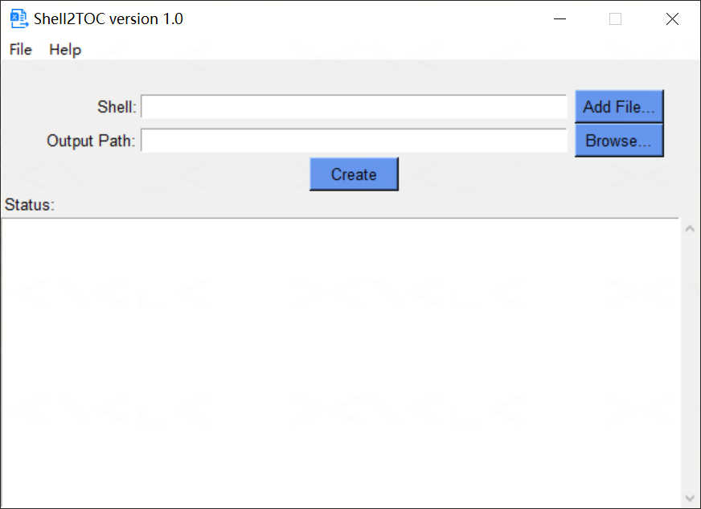
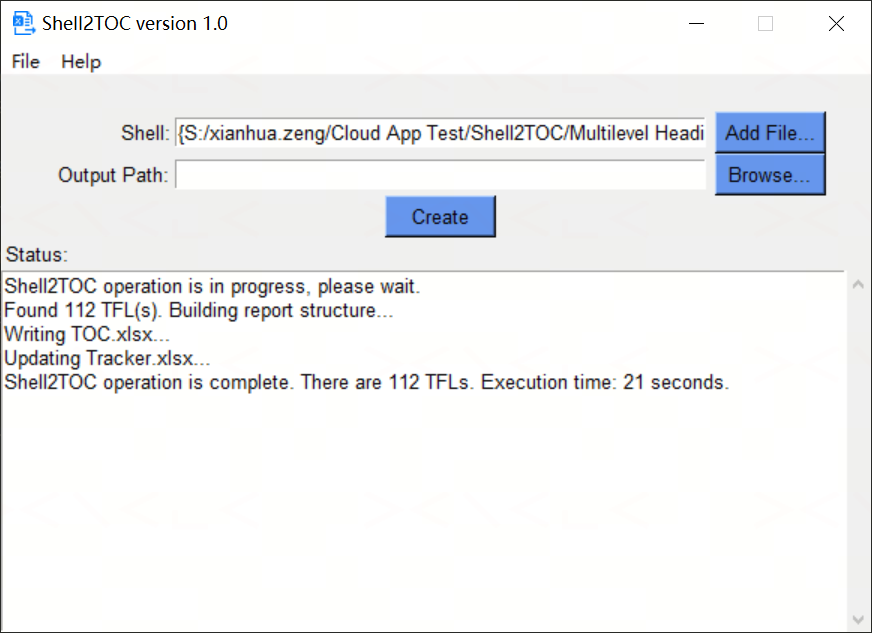

# Shell2TOC

A Windows desktop tool (GUI + CLI) to generate `TOC.xlsx` — and update `Tracker.xlsx` — from a Shell DOCX file, built with Python and Tkinter.

---

## Background

In clinical trial reporting, a "Shell" DOCX defines the structure of every Table, Figure, and Listing (TFL) to be produced: its Table of Contents, output identifiers, titles, and footnotes (program location, programming notes, repeat instructions, etc.). Before SAS programming starts, this structure needs to be turned into a machine-readable `TOC.xlsx` that downstream macros consume, and an existing `Tracker.xlsx` needs its title/category columns refreshed to match.

Doing this by hand is slow and error-prone — TOC entries and Headings can drift out of sync, output identifiers can collide, and footnotes embedded in "repeat for the following displays" blocks or trapped inside three-line tables are easy to miss.

Shell2TOC automates the whole pipeline: it parses the DOCX's Table of Contents and Headings, validates them against each other, resolves repeat/reference footnotes, extracts superscript/subscript formatting, and writes `TOC.xlsx` (plus updates `Tracker.xlsx` if found alongside the input file).

---

## Features

- **TOC ↔ Headings validation** — cross-checks the Table of Contents against document Headings; flags missing spaces between output identifier and title, mismatched titles, and out-of-sync TOC/Headings
- **Duplicate-ID detection (type-aware)** — flags true duplicate output identifiers, while allowing the same number to be shared across types (e.g. `Table 14.4.2.2` and `Figure 14.4.2.2` are not duplicates)
- **Fallback mode** — for shells whose TOC entries have no Table/Figure/Listing prefix (pure numbering, e.g. `14.1.1`), automatically falls back to matching by title text
- **Repeat / reference resolution** — resolves footnotes that say "same as Table X.X.X.X" (including nested references and the newer "Repeat for the following displays:" block style), with duplicate-footnote and self-reference / nested-reference detection
- **Table-trapped footnote extraction** — recovers footnotes that live inside a three-line table immediately following a TFL title (not visible as a standalone paragraph) when that TFL is used as a repeat source
- **空腹/餐后 (fasting/fed) repeat handling** — duplicates the full TOC with `_k`/`_c` suffixes when the shell contains a fasting/fed repeat structure
- **Superscript / subscript extraction** — pulls superscript and subscript runs from the document XML into dedicated `SUPER` / `SUB` sheets for RTF macro use
- **Tracker.xlsx update** — appends Type/Display-name/Title rows to an existing `Tracker.xlsx` found in the same folder as the shell, with borders and formatting applied
- **Legacy DOCX fallback** — if text can't be extracted directly, converts the file via Word COM automation (`pywin32`) before retrying
- **Background processing** — runs in a separate thread so the GUI stays responsive
- **CLI mode** — the full pipeline is available from the command line for scripting and automation

---

## Requirements

| Requirement | Notes |
|---|---|
| Windows | Tested on Windows 10/11; Word COM fallback and `\\SFSAS\...` guide-file lookup require Windows |
| Python 3.8+ | |
| Microsoft Word | Only needed for the legacy-DOCX fallback path (Word COM automation) |

---

## Installation

```bash
git clone https://github.com/XianhuaZeng/Projects.git
cd Projects/Shell2TOC
pip install -r requirements.txt
```

Key dependencies: `python-docx`, `docxpy`, `xlsxwriter`, `openpyxl`, `xlrd`, `pywin32`.

---

## Usage

### GUI mode

Double-click `Shell2TOC.py`, or run:

```bash
python Shell2TOC.py
```



**Steps:**
1. Click **Add File...** and select the Shell DOCX file
2. (Optional) Click **Browse...** to choose an **Output Path** for `TOC.xlsx`. Leave blank to use the shell's own folder
3. Click **Create** to start processing
4. Progress and results stream into the **Status** box in real time; validation errors also pop up as a warning dialog
5. On success, `TOC.xlsx` is written to the output folder, and `Tracker.xlsx` (if found next to the shell file) is updated in place



---

### CLI mode

When any command-line argument is provided, the GUI is skipped and the tool runs entirely in the terminal.

```
python Shell2TOC.py convert -i FILE [-o DIR]
```

| Option | Description |
|---|---|
| `-i`, `--input` | Path to the Shell DOCX file (required) |
| `-o`, `--output` | Output directory for `TOC.xlsx`. Omit to use the same folder as the input file |
| `--version` | Show version and exit |
| `-h`, `--help` | Show help message |

**CLI examples:**

```bash
# Write TOC.xlsx next to the shell file
python Shell2TOC.py convert -i C:\studies\proj01\Shell.docx

# Write TOC.xlsx to a different folder
python Shell2TOC.py convert -i C:\studies\proj01\Shell.docx -o C:\studies\proj01\output

# Show version
python Shell2TOC.py --version
```

Exit codes: `0` — TOC.xlsx generated successfully; `1` — validation error or processing failure.

---

## How it works

1. **Extract TOC text** — `docxpy` pulls the Table of Contents field text; if extraction yields only a single line (common for some legacy/protected DOCX files), the file is converted via Word COM automation and re-extracted
2. **Locate the TOC range** — finds the `目录` / `Table of Contents` heading and isolates the entries that follow it
3. **Validate spacing and structure** — checks for missing spaces between output identifiers and titles, in both the TOC and the document Headings
4. **Cross-check TOC vs. Headings** — confirms the TOC is consistent with the actual Heading paragraphs, and that titles match between the two
5. **Detect duplicate identifiers** — groups entries by normalized ID and type prefix; the same number is only a duplicate if it shares a type prefix (or one entry has no type prefix at all)
6. **Merge multi-level titles** — combines non-TFL lines preceding a Table/Figure/Listing entry (e.g. section headers) into a single combined title string
7. **Build report structure** — walks the document body to associate each TFL with its footnote lines, correctly distinguishing footnotes from "Program location" / "ProgramNote" sections, and recovering footnotes trapped inside three-line tables for repeat-source TFLs
8. **Resolve repeats and references** — replaces "重复X.X.X.X" (repeat-of) footnote markers — including the "Repeat for the following displays:" block style — with the referenced TFL's actual footnotes, detecting self-references and nested references along the way
9. **Write TOC.xlsx** — outputs `ORDER`/`SECTION`/`RTFNAME`/`CAT1-4`/`TITLE1`/`FNOTE1-10` columns, plus `SUPER`/`SUB` sheets for superscript/subscript text
10. **Handle fasting/fed repeats** — if the shell contains a `空腹...餐后` structure, the full TOC is duplicated with `_k` (fasting) / `_c` (fed) suffixes
11. **Update Tracker.xlsx** — if a `Tracker.xlsx` exists next to the shell file, appends Type/Display-name/Title rows for each TFL, bordered and formatted
12. **Clean up** — removes the temporary converted DOCX (if one was created) and writes a usage-tracking record

---

## File detection

- **Shell DOCX** — selected explicitly via the GUI file picker or `-i`/`--input` in the CLI
- **Tracker.xlsx** — looked up automatically in the same folder as the shell DOCX; if not found, `TOC.xlsx` is still created and a note is shown
- **Output folder** — defaults to the shell file's own folder if no output path is given

---

## Project structure

```
Shell2TOC/
├── Shell2TOC.py             # Main application (GUI + CLI)
├── Shell2TOC.ico             # Application icon
├── requirements.txt
├── README.md
├── LICENSE
└── docs/
    ├── screenshot.png
    └── execution_status.png
```

---

## License

MIT License — see [LICENSE](LICENSE) for details.
